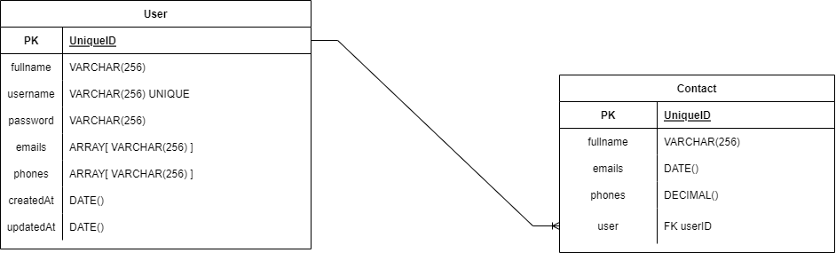

# Agenda - Teste Técnico Fullstack S3

## Sumário

- [Agenda - Teste Técnico Fullstack S3](#agenda---teste-técnico-fullstack-s3)
  - [Sumário](#sumário)
  - [Resumo](#resumo)
  - [1. Desenvolvedor](#1-desenvolvedor)
  - [2. Diagrama de entidades e relacionamentos](#2-diagrama-de-entidades-e-relacionamentos)
  - [3. Preparativos](#3-preparativos)
    - [3.1. Instalando Dependências](#31-instalando-dependências)
    - [3.2. Variáveis de ambiente](#32-variáveis-de-ambiente)
      - [3.2.1 Configurando banco de dados](#321-configurando-banco-de-dados)
    - [3.3. Execute as migrações para realizar a persistência de dados](#33-execute-as-migrações-para-realizar-a-persistência-de-dados)
    - [3.6. Rodando a API localmente](#36-rodando-a-api-localmente)
  - [4. Rotas](#4-rotas)
    - [Documentação da API](#documentação-da-api)
  - [5. Histórico de desenvolvimento](#5-histórico-de-desenvolvimento)
    - [5.1. Objetivo](#51-objetivo)
    - [5.2. Decisões de desenvolvimento](#52-decisões-de-desenvolvimento)
      - [5.2.1. Ordem de desenvolvimento](#521-ordem-de-desenvolvimento)
      - [5.2.2. Interfaces e Entities](#522-interfaces-e-entities)
      - [5.2.3. Middlewares e Schemas](#523-middlewares-e-schemas)
      - [5.2.4. Pontos não cobertos](#524-pontos-não-cobertos)
  - [6. Agradecimentos](#6-agradecimentos)
- [Shalom!](#shalom)

---

## Resumo

[ Voltar ao topo ](#sumário)

Essa aplicação foi desenvolvida para o teste técnico realizado na sprint 3 do módulo 6 para a Kenzie Academy Brasil no intuito de revisar e treinar testes técnicos para o mercado de trabalho.

O objetivo dessa aplicação é servir como um backend para o projeto fullstack de uma Agenda.

**Frontend**
- [Frontend Deploy](https://agenda-teste-tecnico.vercel.app/)
- [Frontend Repositório](https://github.com/brunotiberio/s3-fullstack-teste-frontend-brunotiberio)

**Backend**
- [Backend Documentação: Rotas e requisições](https://doc-fullstack-m6.vercel.app)
- [Backend Repositório](https://github.com/brunotiberio/s3-fullstack-teste-backend-brunotiberio)

Tecnologias usadas nesse projeto:

- [Node](https://nodejs.org/en/)
- [Express](https://expressjs.com/pt-br/)
- [Typescript](https://www.typescriptlang.org/)
- [TypeORM](https://typeorm.io/)
- [Bcrypt](https://www.npmjs.com/package/bcrypt)
- [JsonWebToken](https://jwt.io/)
- [Yup](https://www.npmjs.com/package/yup)
- [EsLint](https://eslint.org/)

## 1. Desenvolvedor

[ Voltar ao topo ](#sumário)

> - [Bruno Tibério Santinoni de Oliveira](https://brunotiberio.vercel.app)

---

## 2. Diagrama de entidades e relacionamentos

[ Voltar ao topo ](#sumário)



---

## 3. Preparativos

[ Voltar ao topo ](#sumário)

### 3.1. Instalando Dependências

Clone o projeto em sua máquina local e instale as dependências do projeto com o comando:

```shell
yarn install
```

ou 

```shell
npm install
```

### 3.2. Variáveis de ambiente

[ Voltar ao topo ](#sumário)

Crie um arquivo **.env** no diretório raiz do projeto, copiando o exemplo do **.env.example**:

```shell
cp .env.example .env
```

#### 3.2.1 Configurando banco de dados

[ Voltar ao topo ](#sumário)

Atribua suas variáveis de ambiente às credenciais do seu PostgreSQL à um database da sua escolha

- POSTGRES_USER=seu_nome_de_usuário_psql
- POSTGRES_PWD=sua_senha_psql
- POSTGRES_DB=nome_do_database

**Variável PORT**:
- Não é necessário atribuir uma porta, porém, recomendamos fortemente que seja atribuído a porta 4000 para que o frontend funcione junto com o backend

**Variável SECRET_KEY**:
- A SECRET_KEY está no .env.exemplo, basta copiar e colar na variável. Isso foi feito para facilitar a configuração do avaliador, porém, em ambiente de produção, não é recomandado que a SECRET_KEY fique em local visível.


### 3.3. Execute as migrações para realizar a persistência de dados

[ Voltar ao topo ](#sumário)

```shell
yarn typeorm migration:run -d src/data-source.ts
```

### 3.6. Rodando a API localmente

[ Voltar ao topo ](#sumário)

Agora que tudo está instalado e configurado, rode a aplicação usando o comando:

```shell
yarn dev
```

Aguarde o processamento e sua aplicação já estará disponível para uso em https://doc-fullstack-m6.vercel.app ou http://localhost:4000/ .

---

## 4. Rotas

[ Voltar ao topo ](#sumário)

### Documentação da API

**Observação: Rode a aplicação como descrito no passo 3**

O consumo pode ser feito tanto pelo deploy do frontend (links logo abaixo), pelo Insonmia e pelo clone do repositório do frontend.

- [Deploy](https://agenda-teste-tecnico.vercel.app/)
- [Workspace do Insomnia](agenda_insomnia.json)
- [Repositório frontend](https://github.com/brunotiberio/s3-fullstack-teste-frontend-brunotiberio)

É possível acessar à documentação completa para poder utilizar a API.

- [Documentação](https://doc-fullstack-m6.vercel.app)

Nessa mesma documentação é possível adquirir informações sobre os requests, chaves necessárias do request e outras informações importantes para a utilização da API.

Interfaces e Entities desenvolvidas:

- Users (CRUD completo)
- Login (POST)
- Contacts (CRUD completo)

---

## 5. Histórico de desenvolvimento

[ Voltar ao topo ](#sumário)

### 5.1. Objetivo

[ Voltar ao topo ](#sumário)

O Objetivo principal dessa aplicação é a validação dos meus conhecimentos nos seguintes tópicos:

- Javascript;
- NodeJs;
- Express;
- TypeScript
- Solucionar demandas;
- Criar um projeto fullstack com API restfull;
- Utilizar Frameworks ou bibliotecas (Opcional)

### 5.2. Decisões de desenvolvimento

[ Voltar ao topo ](#sumário)

#### 5.2.1. Ordem de desenvolvimento

[ Voltar ao topo ](#sumário)

1. Inicialmente, decidi por começar pela análise do teste proposto, com isso, pude observar e pesquisar quais eram as tecnologias, frameworks e libs que poderiam ser usadas no desenvolvimento.
2. Iniciei pelo backend, criando a arquitetura do servidor
   1. Interfaces e Entities;
   2. Middlewares
   3. Services e Controllers
   4. Routes
   5. Error e tratamentos
3. Depois, trabalhei no frontend da aplicação.
4. Por fim, fiz os demais fix necessários do código e a documentação da API

#### 5.2.2. Interfaces e Entities

[ Voltar ao topo ](#sumário)

Foram criados, no total, 2 entities:

- User: Onde é feito o CRUD do usuário será o responsável por logar e administrar seus contatos;
- Contacts: Aqui está o CRUD que pode ser feito pelo usuário devidamente logado;

#### 5.2.3. Middlewares e Schemas

[ Voltar ao topo ](#sumário)

Nessa arquitetura, há duas pastas importantes:

- Middlewares: Onde ficam armazenados os arquivos funcionam como um serviço intermediário ao services e controllers. São utilizados quando é necessário fazer algum tipo de verificação constante no código, evitando o retrabalho:
  - authToken.middleware: Verifica se o usuário está logado;
  - error.middleware: Usado para repassar ao cliente as mensagens de erro;
  - userIsHimself.middleware: Verifica se o usário logado é dono da requisição;
  - verifyUsernameAvailability.middleware: Verifica se o username está disponível para uso;
  - yupValidate.middleware: Usado para o tratamento dos Schemas de validação feitas pelo YUP;
- Schemas: Onde ficam os arquivos utilizados pela biblioteca YUP para verificar possíveis erros de requisição nas rotas, gerando uma camada de proteção maior na API.

#### 5.2.4. Pontos não cobertos

[ Voltar ao topo ](#sumário)

- De todos os feedbacks de erro, o único que não consegui cobrir (está retornando Internal Server Error) é caso em um Update ou List usando um ID.
- Por questões de tempo, não consegui desenvolver os testes da aplicação pois tive que revisar muita informação relacionada a NodeJS, Express e TypeScript, por isso, decidi por focar na finalização de uma aplicação de qualidade

---

## 6. Agradecimentos

[ Voltar ao topo ](#sumário)

Quero agradecer pela oportunidade de fazer o teste técnico e espero ter conseguido cumprir com boa parte daquilo que foi solicitado

# Shalom!

[ Voltar ao topo ](#sumário)
